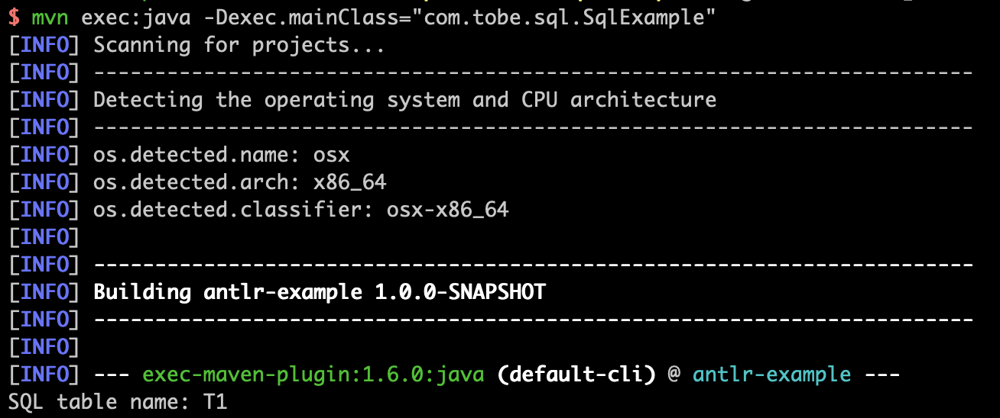

# Antlr SQL Example

## Introduction

This is the example visitor to use Antlr4 to implment the SQL parser.

The visitor is simple and only extract table name from SQL string.

```
public class SimpleSqlVisitor extends SqlBaseBaseVisitor {

    @Override
    public String visitFromClause(SqlBaseParser.FromClauseContext ctx) {
        String tableName = visitRelation(ctx.relation(0));
        System.out.println("SQL table name: " + tableName);
        return tableName;
    }

    @Override
    public String visitRelation(SqlBaseParser.RelationContext ctx) {
        if (ctx.relationPrimary() instanceof TableNameContext) {
            return visitTableName((TableNameContext)ctx.relationPrimary());
        }
        return "";
    }

    @Override
    public String visitTableName(SqlBaseParser.TableNameContext ctx) {
        return visitTableIdentifier(ctx.tableIdentifier());
    }

    @Override
    public String visitTableIdentifier(SqlBaseParser.TableIdentifierContext ctx) {
        return ctx.getChild(0).getText();
    }

}
```

Use the visitor with Antlr lexer and parser.

```
public class SqlExample {

    public static void main(String[] argv) {
        String sqlText = "SELECT C1, C2 FROM T1";

        SimpleSqlVisitor visitor = new SimpleSqlVisitor();
        SqlBaseLexer lexer = new SqlBaseLexer(CharStreams.fromString(sqlText));
        CommonTokenStream tokenStream = new CommonTokenStream(lexer);
        SqlBaseParser parser = new SqlBaseParser(tokenStream);

        parser.singleStatement().accept(visitor);
    }

}
```

## Usage

```
mvn exec:java -Dexec.mainClass="com.tobe.sql.SqlExample"
```


